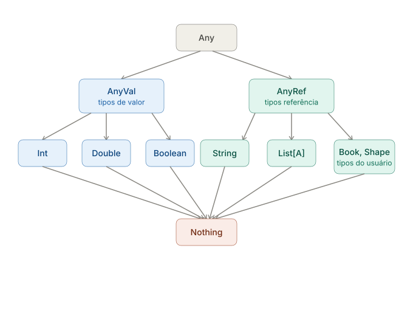

# Árvore de Tipos

Scala não tem uma única "árvore de tipos" fixa e universal — a hierarquia de tipos nativos (o `Any/AnyVal`/`AnyRef` clássico) é bem definida, mas tipos definidos pelo usuário (como `Shape`/`Circle` ou `Pet`/`Dog`/`Cat` dos exercícios) formam sub-árvores que você mesmo cria via herança.

Aqui está a hierarquia raiz do Scala, e como ela se conecta com hierarquias customizadas:

